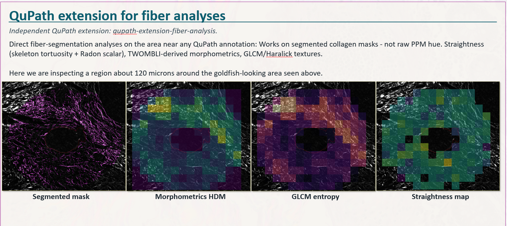
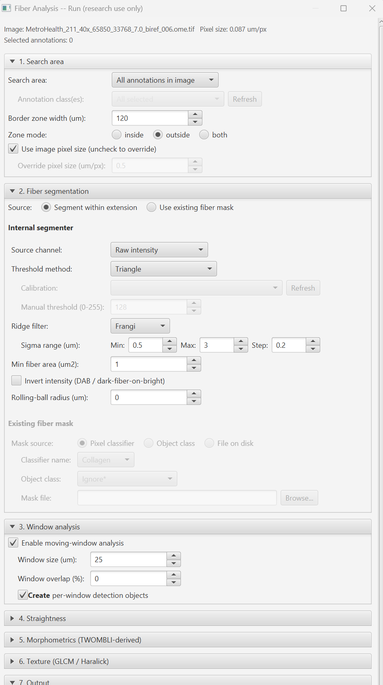

# Fiber Analysis -- User Guide

[Back to README](../README.md)

---

This guide expands on the README's "What the analyses tell you"
section. Each numbered section is collapsible -- click the summary
line to expand. The math notes (sections 5-8) are the source of truth
for what the Python module computes; the README parameter table is
the source of truth for the dialog.

Framing note (per the Phase 0 Lead correction): this extension
analyses **segmented collagen fibers**, not raw birefringence hue.
Orientation, where it appears at all, is the geometric tangent of the
fiber skeleton. There is no hue-to-angle calibration.

---

<details>
<summary><strong>1. Overview</strong></summary>

This extension is a research **testbed** for quantifying collagen
fiber organisation around a user-drawn annotation. It takes a
segmented fiber mask (either produced internally from intensity
thresholding plus optional ridge filtering, or supplied by the user
from a pixel classifier / object class / file) over a **dilated
border zone** around the annotation, and reports three families of
metrics: **straightness / persistence**, **morphometrics** (the
cheap, segmentation-only subset of TWOMBLI), and **GLCM / Haralick
texture**. The headline use case is the wavy-to-straight axis of
collagen organisation -- the same axis underlying TACS-3 in breast
pathology (Conklin et al. 2011) and, more broadly, fiber
reorganisation in tumour invasion, arterial adventitia, sclera,
alveolar wall, and cardiac fibrosis. The PS-TACS workflow shipped by
the production `qupath-extension-ppm` is a related but distinct
analysis (Qian et al. 2025): PS-TACS scores **perpendicularity** of
fibers relative to the boundary using a hue-calibrated orientation
field, whereas this extension scores **shape and texture of the
segmented fibers themselves**, with no hue calibration.

The four outputs from one analysed region -- here a border zone about
120 microns wide -- are the segmented fiber mask, a morphometrics HDM
map, a GLCM entropy map, and a straightness map:



Read the document in order if you are setting up the workflow for
the first time. Section 2 explains how an annotation becomes
per-window metrics; sections 3 and 4 cover the two inputs the user
controls most (search-area dilation and segmentation source); section
5 explains the moving-window grid that the rest of the pipeline
builds on; sections 6-8 are the metric families; section 9 lists
output files; section 10 catches common failures; section 11
collects citations.

</details>

<details>
<summary><strong>2. Workflow</strong></summary>

The pipeline is a linear chain:

```
QuPath annotation
        |
        v
dilated-border zone (mask)        <-- Section 3
        |
        v
fiber segmentation                <-- Section 4
  (internal: threshold + optional ridge filter)
  (existing: pixel classifier / object class / file)
        |
        v
moving-window grid over the zone  <-- Section 5
        |
        v
+-----------------+-----------------+-----------------+
|                 |                 |                 |
v                 v                 v                 v
per-window      per-window       per-ROI         per-window
tortuosity      morphometrics    Radon scalar    GLCM features
(Section 6)     (Section 7)      (Section 6)     (Section 8)
        |
        v
overlays (PNG) + windows.json + optional PathObjects
```

The Run dialog drives this chain. Section 1 sets the search area
(border zone width and zone mode), Section 2 picks the segmentation
source, and Section 3 configures the moving-window grid; the
Straightness, Morphometrics, Texture, and Output sections follow
below:



The Java side reads the annotation geometry, rasterises the dilated
border zone, and dispatches an Appose task with the parameter dict.
The Python module (`fiberlib/`) is bundled inside the JAR; it loads
from JAR resources at run time so the analysis code is always in
sync with the JAR you installed. The Appose env (Pixi-managed) lives
at `~/.local/share/appose/qupath-fiber-analysis/` and is built on
first use.

## Reproducing a run from disk

Every analysis that writes files (per-annotation Run, Project density map,
Project calibration) also drops three companion artifacts next to its
outputs:

- `params.json` -- pretty-printed JSON: extension version, timestamp,
  run id, and every dialog control.
- `params.txt` -- same key/value pairs as plain `key = value` lines; easy
  to skim or grep.
- `rerun.groovy` -- a Groovy script that re-executes the same analysis
  headlessly. Project path, image name, and `params.json` path are baked
  into the top of the file as string literals; edit them if the project
  moves.

To re-run from disk with no GUI:

```
~/path/to/QuPath script <output-dir>/rerun.groovy
```

The Groovy templates use the existing extension entry points (the same
`runForAnnotations` / `runForEntries` / `FiberCalibrationRunner.run` the
GUI dialogs call). Output goes to the same on-disk location as the
original GUI-driven run -- a re-run replaces the previous run's files in
place.

## Project density map (whole-slide)

For density-of-fiber maps across an entire slide, use the separate
**Project density map** workflow rather than the per-annotation Run
dialog. It tile-streams each selected image, runs the same per-window
computations, and writes a uint16 pyramidal OME-TIFF "sidecar" per
image at
`<project>/fiber-analysis/density-maps/<image>_density.ome.tif`.

Two output modes, picked in the dialog:

- **Sidecar + sampling commands** (default; safer for RGB images).
  The sidecar lives on disk; pull per-object density values into
  the measurement table via `Sample fiber density into
  measurements`. The base image's native display is untouched.
- **Attach as channels**. After the sidecar lands, its channels are
  concatenated onto the source server in the open viewer. Use this
  if you want QuPath's `Analyze > Calculate Features > Add
  intensity features` or any density-aware classifier to see the
  density as channels. On RGB base images the wrapper forces
  multi-channel uint16 and the native RGB display path is lost;
  the attacher auto-configures the first three channels as red /
  green / blue LUT colours so you get the RGB look back, but the
  result is not pixel-identical to the original.

The dialog blocks runs on uncalibrated images and on mixed-pixel-type
selections when Channels mode is picked; warns (but allows) on
Channels mode with RGB base images. An optional
**"Auto-reattach channels on image open"** checkbox writes a small
marker file beside the sidecar; the extension installs an image-open
listener that re-attaches automatically on every future open in this
project. To stop: `Stop auto-reattaching density channels` (deletes
the marker; sidecar stays).

Sidecar format (recoverable units): channels are uint16 with
sentinel `raw=0` for no-data. Per-channel scale + offset live in
the OME-XML image description so `real = raw * scale + offset` round-
trips the original float values. Channel names match the QuPath
measurement-table column names (`Fiber coverage (%)`, `HDM`,
`Ridge count`, `Skeleton length (um)`, `Branch points`,
`Mean angle (deg)`, `Order parameter`). Pixel size = `stride_px *
source_pixel_size_um`, so QuPath aligns the sidecar back to the
source physically.

See the project README's "Project density map (WSI scale)" section
for the full menu / validation matrix / limitations.

### Calling fiberlib as a library (outside QuPath)

The entire pipeline is also a plain Python function -- the Appose task
script (`scripts/run_fiber_analysis.py`) is only a thin wrapper that
unpacks the injected globals, loads the PNGs, and calls it. To run the
exact same analysis from host Python (tests, batch jobs, the
collagen-phantom tooling):

```python
import fiberlib                      # pip install -e . , or add the
                                     # fiberanalysis resource dir to sys.path
out = fiberlib.analyze(
    image,                           # numpy (H, W) or (H, W, 3)
    pixel_size_um=0.5,
    zone_mode="inside",              # whole-field analysis: 'inside' + a
    border_zone_width_um=800,        # border wider than the region
    window_enabled=True, window_size_um=80,
)
metrics = out["result"]              # JSON-friendly summary dict
windows = out["window_grid"]         # per-window arrays (or None)
```

`analyze()` takes the same parameter names the Appose side injects (see
its docstring), returns `result` / `window_grid` / `fiber_mask` /
`analysis_mask` / `skeleton`, and only writes sidecar files when
`output_dir=` is given. A repo-root `pyproject.toml` exposes `fiberlib`
via `pip install -e .`. Note the analysis runs inside the dilated zone
around the boundary mask, so for a whole-image baseline pass a full
boundary with `zone_mode="inside"` and a large `border_zone_width_um`.

Outputs land in the per-annotation subfolder under the output
directory and are also surfaced as buttons on the results panel
card. At most one overlay is shown on the image at a time -- clicking
a different `[Show ...]` button replaces the current overlay;
`[Hide overlay]` clears it.

</details>

<details>
<summary><strong>3. Search area (dilated border zone)</strong></summary>

The search area is a band of pixels within a configurable distance
of the annotation boundary. Three controls govern it (Section 1 of
the dialog):

- **Border zone width (um)** -- the distance from the boundary
  contour, in image units. Default 50 um; the same default as PPM's
  perpendicularity workflow, so the two extensions can be compared
  apples-to-apples.
- **Zone mode** -- which side of the boundary to keep:
  - `outside` -- stromal side only (most common when the annotation
    encloses a tumour).
  - `inside` -- inside the annotation polygon only (rare; used when
    the annotation encloses the stromal region of interest).
  - `both` -- a symmetric band straddling the boundary.
- **Fill holes** is performed automatically before computing the
  distance transform, mirroring the PPM convention. Small interior
  holes in the annotation would otherwise create stray inner
  boundaries.

Implementation: the zone mask is built by `compute_border_zone_mask`,
lifted verbatim (with attribution comment) from `ppm_library`'s
`surface_analysis.py` -- MIT-licensed, identical semantics to PPM's
search-area pattern. The implementation is `binary_fill_holes` ->
`distance_transform_edt` of the boundary -> threshold at the
dilation distance, with the zone-mode mask applied at the end.

Practical guidance: if you see metric values change significantly
when you increase the band width past ~100 um, the analysis is
picking up structure beyond the immediate boundary -- which may or
may not be desired. Smaller bands (~25 um) tighten the boundary
focus but increase per-window noise (fewer fibers per window).

</details>

<details>
<summary><strong>4. Fiber segmentation</strong></summary>

The extension supports two segmentation modes selected by the
top-of-section radio button. The choice is binary at runtime; the
disabled mode's controls stay visible but greyed.

**Mode A: Segment within extension (Internal).** The image is
projected onto a scalar **source channel** (Value of HSV by default,
or Raw intensity / Hue / Saturation / Value / a named channel), then
thresholded with **Otsu**, **Triangle**, or **Manual** at a chosen
gray level. The manual cutoff is in the source image's **own gray
levels**, so on a single-channel 16-bit image the spinner runs
0-65535 and typing 4500 cuts at 4500 -- in every region and every
image, not rescaled to each region's brightest and darkest pixel.
Optionally a **ridge filter** (Frangi, Sato, or
Meijering from scikit-image) runs first across a configurable
**sigma range** (default 1-4 px, step 1) to enhance line-like
structures before the threshold. The thresholded mask is then
cleaned: `binary_closing` to bridge 1-px gaps, then
`remove_small_objects` at the **Min fiber area** (default 50 px).
The clean mask is the fiber segmentation.

Two limits worth knowing before choosing Manual:

- A **ridge filter changes what the number means.** A vesselness
  response carries no image units, so with Frangi / Sato / Meijering
  selected the manual value is read as that same fraction of full
  scale (4500 of 65535 = 6.9%) of the response's own range. Otsu and
  Triangle are unaffected either way.
- A **multi-channel 16-bit source reaches the segmenter as 8-bit.**
  Regions are handed to Python as PNG, and PIL has no 16-bit colour
  mode, so a 16-bit RGB region is truncated on load (raw 4500 arrives
  as 17). The spinner caps at 255 for those images to match what the
  segmenter can actually see. Single-channel 16-bit survives intact.

Practical guidance for mode A:

- **Brightfield Picrosirius Red.** Value channel + Otsu + ridge
  filter `None` is the usual starting point. The collagen signal is
  high-Value, so Value-Otsu separates it well. Add a Frangi sweep
  (sigma 1-3 px) if fibers are dim and partially merged.
- **Polarised-light / PPM birefringence.** Saturation channel +
  Otsu often works because birefringent collagen produces high
  saturation. Threshold rarely needs ridge filtering here.
- **Picrosirius Red on H&E counter-stain (PSR+H&E).** Hue-channel
  thresholding is delicate -- use a pixel classifier instead (Mode
  B). Try this only if the H&E nuclei are very pale.
- **Fluorescence collagen labels (e.g. SHG).** Raw intensity + Otsu.

**Mode B: Use existing fiber mask.** Three sub-sources:

- **Pixel classifier** -- pick a classifier trained in the current
  project. The classifier output is rasterised to a binary fiber
  mask on the dilated-zone region.
- **Object class** -- pick a PathClass; the Java side rasterises all
  objects of that class into a binary mask before dispatching the
  Appose task.
- **File on disk** -- a `.tif` or `.npy` file with a binary mask
  matching the analysed image dimensions.

Practical guidance for mode B: if you have already trained a pixel
classifier on this image type, **prefer Mode B** -- the classifier
sees more context than a per-channel threshold and is more robust
to staining variation. Mode B also lets you reuse a curated
segmentation across many annotations.

**Honest limit on metric quality.** Segmentation quality bounds
metric quality. A mask with broken fibers gives an inflated branch-
point count and a depressed straightness (skeleton paths between
the breaks are shorter and straighter individually, but there are
more of them). Check the `fiber_mask_overlay.png` against the raw
image before interpreting straightness or morphometrics. Texture is
slightly less segmentation-sensitive because GLCM operates on the
quantised scalar image rather than the binary mask -- but
segmentation still gates which windows have enough fibers to score.

</details>

<details>
<summary><strong>5. Window analysis</strong></summary>

Once the dilated zone is segmented, a **moving-window grid** is laid
over it. Square windows of side `W_um` (default 15 um, matching
PPM's Phase-2 default) tile the zone, with stride `W_um * (1 - p)`
where `p` is the overlap fraction (default 0). Larger windows
(~30-50 um) are recommended when Radon straightness is the headline
metric; smaller windows resolve finer spatial variation but increase
per-window noise.

The grid implementation is lifted from PPM's `compute_window_alignment`
(MIT, attribution comment retained). It computes the per-window mean
fiber-pixel count plus the **axial circular statistics** described in
the math note below. The same window list is then re-used by the
straightness, morphometrics, and texture families so that all
per-window records line up in `windows.json`.

**Math note -- axial circular statistics.** Fiber tangent angles
are axial (`theta` and `theta + 180` indistinguishable), so the
doubling trick applies. Per window of N fiber pixels:

```
mean_2theta = arctan2( sum(sin 2 theta_i) , sum(cos 2 theta_i) )
mean_theta  = mean_2theta / 2 mod 180
OS          = sqrt( mean(cos 2 theta_i)^2 + mean(sin 2 theta_i)^2 )
```

`OS` is in `[0, 1]` (0 = isotropic, 1 = perfect axial alignment),
equivalent to vector coherence after angle doubling, and the same
OS reported by PPM's Phase-2 windowed analysis -- so the two
extensions can be compared directly.

A window is considered **non-empty** if its fiber-pixel count
exceeds a small floor (the same `min_pixels` floor PPM uses);
metrics for empty windows are written as `NaN` in `windows.json` and
shown as transparent in the heatmaps.

</details>

<details>
<summary><strong>6. Straightness</strong></summary>

Two complementary straightness measurements: **per-window skeleton
tortuosity** for the heatmap, and a **per-ROI Radon scalar** for the
overall rigidity score on the annotation.

**Math note -- skeleton tortuosity.**
`skimage.morphology.skeletonize` once per ROI (medial axis, O(N^2)).
Walk paths between branch / end-points; per path:

```
straightness = chord_length / arc_length     in [0, 1], 1 = straight
```

CT-FIRE convention (Bredfeldt et al. 2014), same direction as `OS`.
Aggregate per window with median (robust to short spurs) plus
N-fibers for weighting. Apply `binary_closing` and a minimum-branch-
length prune (`min_branch_um`, default 5 um) to suppress noise spurs
that depress the ratio.

**Math note -- per-ROI Radon.** scikit-image
`radon(biref_intensity * fiber_mask, theta=arange(0, 180), circle=False)`.
Chord-normalise (divide each column by chord length through the
aperture at `(rho, theta)`) to suppress the spurious 45 deg peak.
Scalars (Schaub & Gilbert 2011; see also Despotovic & Cosic 2022 for
additional method support):

```
PMR  = max_theta || R(., theta) ||_inf  /  mean_theta || R(., theta) ||_inf
AI   = ( max E - min E ) / ( max E + min E ),   E(theta) = sum_rho R^2
FWHM(theta*) of R(., theta*)   (narrower = straighter)
entropy of normalised angular profile
```

PMR is the headline straightness scalar per dilated-border segment;
entropy detects misalignment to ~+/-2 deg vs FFT's +/-4 deg (Schaub
2011).

**When to use which.** Tortuosity is per-window and per-fiber; it is
the right number to drive the **heatmap** (`straightness_overlay.png`)
because it varies smoothly across the zone and tracks waviness on
the scale of individual fibers. The Radon scalar is per-ROI and per-
**bulk-alignment**; it is the right number for a **single rigidity
score** on the annotation (one number, comparable between
annotations and samples). Han et al. 2025 (npj Breast Cancer) report
useful TACS scoring at 150-180 um ROIs, which is the natural Radon
unit; per-window tortuosity scales below that.

</details>

<details>
<summary><strong>7. Morphometrics (TWOMBLI-derived)</strong></summary>

Native re-implementation of the cheap segmentation-only metrics from
TWOMBLI (Wershof et al. 2021, *Life Sci Alliance* 4(3):e202000880).
This is **not** a port of the TWOMBLI FIJI macro: the macro is
unlicensed, so its source code is not used, and the underlying FIJI
plugins (Ridge Detection, AnaMorf, OrientationJ, BIOP Max Inscribed
Circles) are GPL and not bundled. Native numbers will **not** match
TWOMBLI numerically to 3 decimals -- different implementations of the
same published metric. The TWOMBLI repo
([github.com/wershofe/TWOMBLI](https://github.com/wershofe/TWOMBLI))
is cited for provenance.

All seven metrics derive from the skeleton + mask pair the
straightness pipeline already computes.

**Math notes.**

- **HDM:** `sum(fiber_mask) / area(zone)`.
- **Total fiber length:** skeleton pixel count * pixel size; skeleton
  reused from the straightness pipeline.
- **Branch / end-point counts:** 8-neighbour count per skeleton
  pixel -- `n >= 3` = branch, `n == 1` = end-point.
- **Curvature:** mean tangent rotation per skeleton segment of length
  `L_segment` (default 5 px).
- **Fractal dimension** (box-counting): for `b = 2, 4, 8, 16, ...`,
  count `N(b)` boxes intersecting the skeleton; fit
  `log N(b) = -D_fractal * log b + c`. Expect parameter sensitivity
  (see Caveats in the README); the default box sizes
  `2,4,8,16,32,64,128` give a stable D for collagen networks but are
  worth varying if you suspect dimension drift.
- **Lacunarity** (gliding-box): mean / variance of box mass `M(r)`
  over positions; `L(r) = var(M) / mean(M)^2 + 1`. Reported per `r`,
  aggregated by area-under-curve.
- **Gap analysis:** distance transform of `~fiber_mask`; per-gap max
  inscribed circle = local max of the distance transform. Report
  distribution of gap diameters.

**Out-of-v1 scope.** Steger ridge detection (Steger 1998, *IEEE TPAMI*
20(2):113-125) supplies a width-annotated centreline and is the
basis for TWOMBLI's fiber-WIDTH distribution. We do not include it
in v1; the ridge filters in Section 4 (Frangi / Sato / Meijering)
supply a binary mask, not a width-annotated centreline. Fiber-width
distributions are therefore not reported. This may graduate to v2 if
fiber width becomes a hard requirement; see the 2026-05-22
feasibility brief.

</details>

<details>
<summary><strong>8. Texture (GLCM / Haralick)</strong></summary>

Per-window GLCM / Haralick features via
`skimage.feature.graycomatrix` and `skimage.feature.graycoprops`.
Cites Aerts et al. 2014 (radiomics feature set) and Depeursinge et
al. 2014 (3-D texture review -- we use the 2-D math, not 3-D).

**Math note -- GLCM and Haralick features.** Compute on a single
derived scalar channel (biref intensity, or grayscale of the RGB),
not raw RGB.

1. **Quantise** to `L = 16` (or 32) gray levels (uniform binning,
   per-window min-to-max).
2. **GLCM** `P_d_theta(i, j)` = pixel-pair count for gray levels
   `(i, j)` at offset `(d, theta)`. `d in {1, 2, 3}` (`d <=
   window_side / 8`), `theta in {0, 45, 90, 135 deg}`, averaged.
3. **Features** (scikit-image `graycoprops`) on normalised
   `P(i, j)`:

```
contrast      = sum_{i,j} (i-j)^2 P(i,j)
dissimilarity = sum_{i,j} |i-j|   P(i,j)
homogeneity   = sum_{i,j} P(i,j) / (1 + (i-j)^2)
energy        = sum_{i,j} P(i,j)^2
correlation   = sum_{i,j} (i - mu_i)(j - mu_j) P(i,j) / (sigma_i sigma_j)
entropy       = - sum_{i,j} P(i,j) log P(i,j)
```

**Biological reading.** Contrast / dissimilarity rise with abrupt
edges (sharp fiber boundaries, sparse clumps). Homogeneity / energy
rise with uniform fields (dense mats). Correlation rises with
oriented structure (aligned bundles). Entropy rises with disorder --
intratumour-heterogeneity proxy per Aerts 2014. Li et al. 2021
(*BMC Medicine*) report prognostic value for texture-augmented
collagen signatures along the same lines. Reported per window;
per-property heatmaps available -- one per run, via the **GLCM
heatmap property** dropdown in the output section.

**Choosing parameters.** Quantisation `L = 16` is appropriate for
small windows (15-30 um); `L = 32` is appropriate for larger windows
(50+ um) where each window has enough samples to populate the
larger GLCM stably. The distance set `1, 2, 3` captures texture at
multiple scales without exceeding the recommended `d <= window_side
/ 8` rule of thumb. The six properties are independent calculations
-- turn off ones you do not need to reduce `windows.json` size; the
runtime cost is dominated by GLCM construction, not property
extraction.

**Out-of-v1 scope.** Multichannel HSV-cube Haralick via mahotas is
v2, not v1. True-3D / volumetric texture features (the focus of
Depeursinge 2014) are out of scope -- our data are 2-D; only the
feature math transfers.

</details>

<details>
<summary><strong>9. Outputs</strong></summary>

Each annotation gets a per-annotation subfolder under the output
directory. Filenames are ASCII; conventions parallel PPM's
per-annotation outputs.

**Files.**

- `windows.json` -- per-window records (centre, size, fiber-pixel
  count, one column per enabled metric). Schema:

```
{
  "x": int,                     # top-left x in image pixels
  "y": int,                     # top-left y in image pixels
  "w": int,                     # window width in pixels
  "h": int,                     # window height in pixels
  "n_fiber_px": int,            # fiber-pixel count inside the window
  "mean_angle_deg": float,      # circular mean of axial skeleton tangent (0-180)
  "order_parameter": float,     # axial OS in [0, 1]
  "tortuosity_median": float,   # per-window median chord/arc (when enabled)
  "n_fibers": int,              # path count contributing to tortuosity
  "glcm_<prop>": float,         # one field per enabled GLCM property
  "hdm": float,                 # local HDM (when enabled)
  ...
}
```

- `fiber_mask_overlay.png` -- segmented fiber mask as a translucent
  RGBA overlay (Greys colormap; transparent outside the dilated
  zone).
- `straightness_overlay.png` -- viridis heatmap of per-window
  tortuosity / Radon scalar (alpha-masked outside the dilated zone).
- `texture_<prop>_overlay.png` -- magma heatmap of the selected
  GLCM property (one per run).
- `morphometrics_overlay.png` -- per-window morphometric heatmap.

**Optional sidecars.**

- `window_metrics.npz` -- raw per-window numpy arrays
  (`mean_angle_deg`, `order_parameter`, `n_pixels`, `centers_px`,
  `tortuosity_median`, `n_fibers`, `glcm_<prop>` per enabled
  property, `hdm`, plus scalar metadata `window_px`, `stride_px`,
  `min_pixels`). For non-JSON consumers (e.g. matplotlib analysis
  scripts).
- `results.json` -- the full result dictionary (per-annotation
  scalars, parameter echo, and a copy of the windows table for
  self-contained reproducibility).
- Per-window **PathObjects** in the QuPath hierarchy -- one
  rectangular `PathDetectionObject` per non-empty window, carrying
  the same measurements as the `windows.json` record. **Off by
  default** because at 15 um windows on a 100 um band, a few
  thousand objects are easy to produce.

</details>

<details>
<summary><strong>10. Troubleshooting</strong></summary>

| Symptom | Likely cause | What to try |
|---|---|---|
| "No fibers found" or empty mask overlay | Threshold method does not match staining; ridge filter sigma range off | Open `fiber_mask_overlay.png` -- if blank, switch source channel or try a different threshold method (Otsu -> Triangle, or Manual at ~30% of the dynamic range). On Picrosirius+H&E, switch to a pixel classifier (Mode B). |
| Blocky heatmap with visible window edges | Window overlap too low; window size too large for the structure | Increase overlap to 50%; reduce window size (15 um -> 7-10 um); but watch for NaN windows. |
| Per-window metric NaN in `windows.json` | Window had fewer fiber pixels than `min_pixels` floor | Either accept the gaps (they appear transparent in the heatmap) or lower the window size so each window has enough fibers. |
| Appose env will not build / build hangs | Stale `pixi.lock`; corrupted env; pixi cache permissions | `Extensions > Fiber Analysis > Setup environment...` to rebuild; or delete `~/.local/share/appose/qupath-fiber-analysis/pixi.lock` and `.pixi/` and rerun. |
| Appose env build fails on Windows | Pixi cache directory not writable; firewall blocking conda-forge | Run `Extensions > Fiber Analysis > Setup environment...` to rebuild; check that the Pixi cache directory (`%LOCALAPPDATA%\rattler\cache`) is writable and that conda-forge is reachable. |
| Windows cp1252 crash on a class name with non-ASCII characters | A user-supplied class name or annotation name contains non-ASCII characters that the logger cannot encode | Logs are ASCII-only by design; rename the offending class or annotation to ASCII (the analysis itself does not care, but the log line that mentions it will crash). |
| Fractal dimension or lacunarity oscillates between runs on similar images | Box-size choices not robust for the fiber scale | Widen the **Fractal box sizes** range (add larger sizes); for lacunarity, ensure the box sizes span the largest gap visible in the image. |
| Straightness near 1.0 across all windows | Skeleton noise spurs are being walked as short, straight paths | Increase **Min branch length** to 8-10 um to prune more aggressively. |

If a non-listed failure mode comes up, save the QuPath log file
(`Help > Show log...`) and the Python script output from the
`results.json` sidecar; both are needed to diagnose Appose issues.

</details>

<details>
<summary><strong>11. References</strong></summary>

Citations for the algorithms and claims in this document. All
appear in the shipped docs (this user guide + the README), not only
in internal artifacts, per the project's
`cite-sources-in-user-facing-docs` policy.

Aerts H J W L, Velazquez E R, Leijenaar R T H, et al. (2014).
  Decoding tumour phenotype by noninvasive imaging using a
  quantitative radiomics approach. *Nature Communications* 5:4006.
  -- Texture feature set framing (section 8, README "What the
  analyses tell you").

Bredfeldt J S, Liu Y, Pehlke C A, Conklin M W, Szulczewski J M,
  Inman D R, Keely P J, Nowak R D, Mackie T R, Eliceiri K W (2014).
  Computational segmentation of collagen fibers from second-harmonic
  generation images of breast cancer. *Journal of Biomedical Optics*
  19(1):016007. -- CT-FIRE chord/arc straightness convention
  (section 6, README "What the analyses tell you").

Conklin M W, Eickhoff J C, Riching K M, Pehlke C A, Eliceiri K W,
  Provenzano P P, Friedl A, Keely P J (2011). Aligned collagen is a
  prognostic signature for survival in human breast carcinoma.
  *American Journal of Pathology* 178(3):1221-1232. -- TACS-3
  prognostic axis, HR 3.0-3.9 (section 1, section 6, README).

Depeursinge A, Foncubierta-Rodriguez A, Van De Ville D, Muller H
  (2014). Three-dimensional solid texture analysis in biomedical
  imaging: review and opportunities. *Medical Image Analysis*
  18(1):176-196. -- 3-D texture framing; we use the 2-D math only
  (section 8, README).

Despotovic I, Cosic D (2022). Radon transform-based methods for
  fiber alignment analysis. *Frontiers in Physics* 10:915644.
  -- Additional method support for Radon-based fiber alignment
  (section 6).

Han B, Sun K Y, et al. (2025). Computer-assisted TACS scoring of
  collagen organisation in breast cancer at 150-180 um ROIs.
  *npj Breast Cancer*. -- ROI sizing for TACS scoring (section 6).

Han W, Chen S, Yuan W, Fan Q, Tian J, Wang X, Chen L, Zhang X, Wei
  W, Liu R, et al. (2016). Oriented collagen fibers direct tumor
  cell intravasation. *Proceedings of the National Academy of
  Sciences* 113(40):11208-11213. -- Mechanical/biological framing
  for waviness loss (section 1, section 6).

Hapach L A, Carey S P, Schwager S C, Taufalele P V, Wang W, Mosier
  J A, et al. (2022). Phenotypic heterogeneity of breast cancer
  cells motility and migration. *Communications Biology* 5:1051.
  -- Mechanical/biological framing (section 1, section 6).

Li H, Bera K, Toro P, et al. (2021). Collagen fiber orientation
  disorder from H&E images is prognostic for early stage breast
  cancer: clinical trial validation study. *npj Breast Cancer*
  7:104. (related framing in *BMC Medicine* series) -- Prognostic
  value of texture-augmented collagen signatures (section 8).

Provenzano P P, Inman D R, Eliceiri K W, et al. (2008). Collagen
  density promotes mammary tumor initiation and progression. *BMC
  Medicine* 6:11. -- Foundational framing for collagen-density and
  organisation in tumour biology (section 1, section 6).

Qian X, Guhan R, et al. (2025). Perpendicularity Score for Tumor-
  Associated Collagen Signatures (PS-TACS). *American Journal of
  Pathology* 195(7):1242-1255. -- Boundary-referenced PS-TACS
  method; related but distinct from this extension (section 1
  relationship note only).

Schaub N J, Gilbert R J (2011). Radon transform-based methods for
  characterizing fiber alignment in tissue-engineered scaffolds.
  *Proceedings of SPIE* 7897:78970M. -- Radon entropy detects
  misalignment to ~+/-2 deg vs FFT's +/-4 deg (section 6, README).

scikit-image (van der Walt S, Schonberger J L, Nunez-Iglesias J, et
  al.; 2014). scikit-image: image processing in Python. *PeerJ*
  2:e453. Specifically `feature.graycomatrix`, `feature.graycoprops`,
  `morphology.skeletonize`, `transform.radon`, and the Frangi /
  Sato / Meijering ridge filters under `filters`. (sections 6, 7, 8).

Steger C (1998). An unbiased detector of curvilinear structures.
  *IEEE Transactions on Pattern Analysis and Machine Intelligence*
  20(2):113-125. -- Ridge detection (deferred reference for v2
  fiber-width distributions; not implemented in v1; section 7).

Wershof E, Park D, Barry D J, Jenkins R P, Rullan A, Wilkins A, Schlegelmilch K,
  Roxanis I, Anderson K I, Bates P A, Sahai E (2021). A FIJI macro
  for quantifying pattern in extracellular matrix (TWOMBLI).
  *Life Science Alliance* 4(3):e202000880.
  ([github.com/wershofe/TWOMBLI](https://github.com/wershofe/TWOMBLI),
  cited for provenance, not copied). -- TWOMBLI morphometric panel:
  HDM, length, branch/endpoint counts, fractal dimension,
  lacunarity, gap analysis (section 7, README).

</details>
